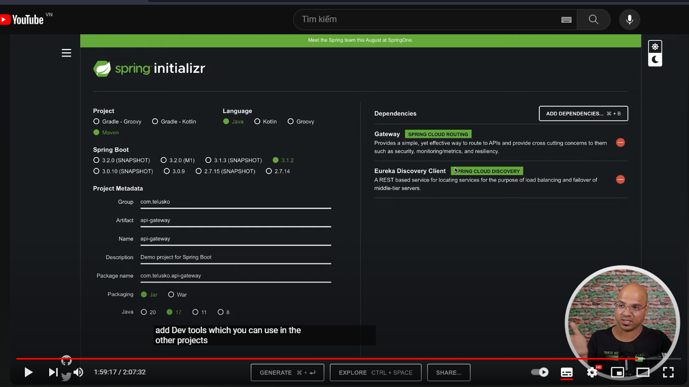
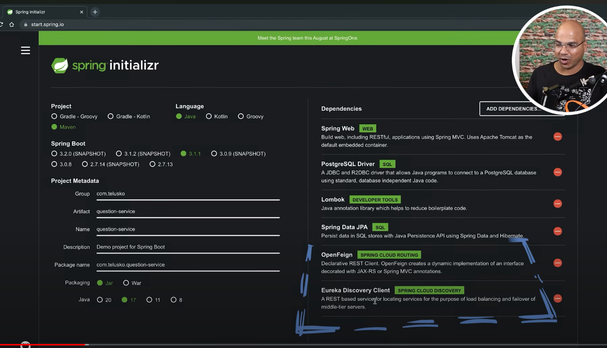
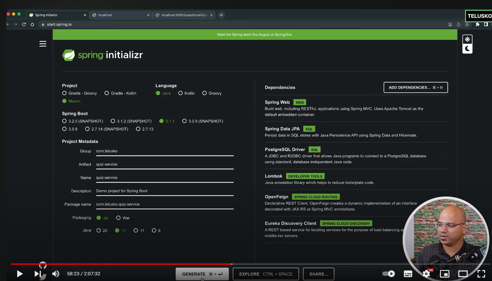

# micro service basic 

# api gateway
- spring-cloud-starter-gateway
- spring-cloud-starter-netflix-eureka-client
- application.property
- port 8765
```angular2html
spring.application.name=api-gateway
server.port=8765

spring.cloud.gateway.discovery.locator.enabled=true
spring.cloud.gateway.discovery.locator.lower-case-service-id=true
```

# service-register
- spring-cloud-starter-netflix-eureka-server
- @EnableEurekaServer
- port 8761
```angular2html
spring.application.name=service-registry
server.port=8761

eureka.instance.hostname=localhost
eureka.client.fetch-registry=false
eureka.client.register-with-eureka=false
```

# API gate way 



# question service 



# Quiz service 


# About project 
repository: https://github.com/navinreddy20/MicroserviceTutorials

video : https://youtu.be/h6aDu9e2L_s?t=7291


client -> api gateway -> register service -> controller -> service 


open Eureka 


